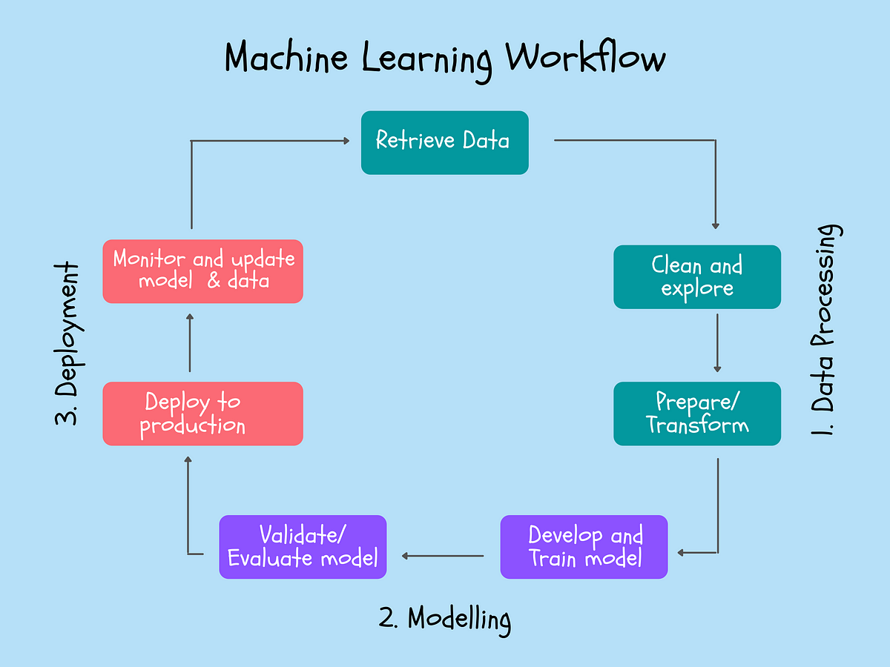
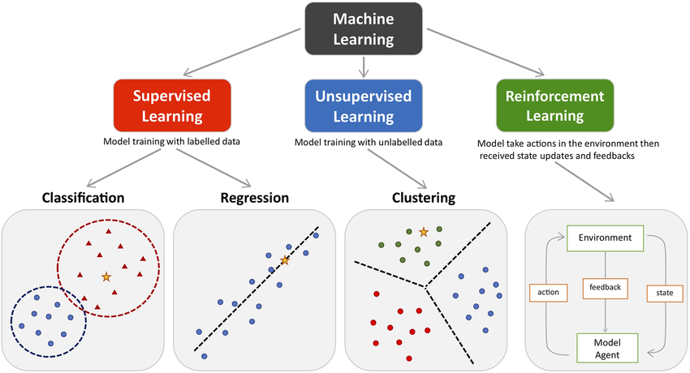
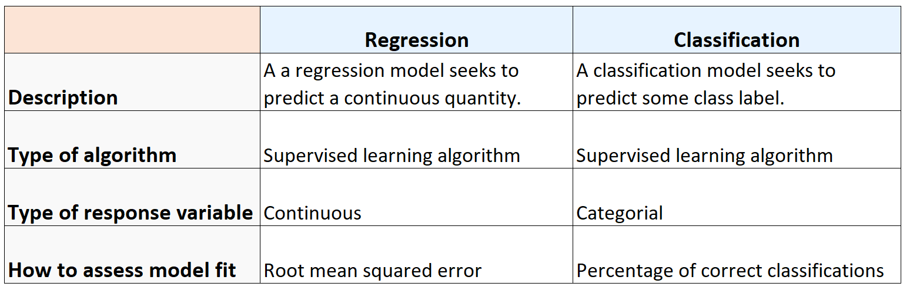
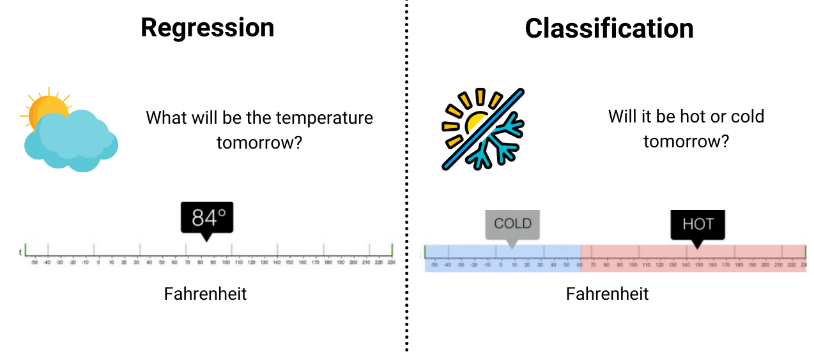

# Week 2: Data Preprocessing & Visualization, Introduction to Machine Learning & Classification

Welcome to Week 2 of CRUX's Machine Learning Summer Group! This week, we'll be diving into actual Machine Learning - Exploring and understanding what 'Machine Learning' really means, the steps involved in any machine learning project's workflow, and ending with a simple binary classification task, where you will write your first machine learning model! 

Before that, however, we have a short introduction to Data Preprocessing, a major step in any ML project's workflow.

After that, head over to the data visualization notebooks #1 and #2 to learn about exploring data visually.

Then, return to this README to understand exactly what is meant by the phrase 'Machine Learning'.

Finally, head over to notebook #3 to build your first classification model!

## A Beginner's Guide to Data Preprocessing

Data (pre)processing is a crucial step in the machine learning pipeline. It involves transforming raw data into a clean and usable format for training and testing machine learning models. Effective preprocessing improves the quality of the data and can significantly enhance the performance of the models. Here’s an introduction to the key steps involved in data preprocessing:

1. Data Collection

    The first step is gathering raw data from various sources. Data can come from databases, files, web scraping, sensors, APIs, etc. The quality and quantity of data collected will impact the subsequent steps.

2. Data Cleaning

    Data cleaning involves handling missing, inconsistent, or noisy data. Common steps include:

* Handling Missing Values: Missing data can be addressed by:
    * Removing records with missing values (if few).
    * Imputing missing values using mean, median, mode, or more advanced techniques like K-nearest neighbors (KNN) imputation.
* Removing Duplicates: Identifying and removing duplicate records to avoid bias.
* Correcting Errors: Fixing or removing incorrect data entries.
* Dealing with Outliers: Identifying and handling outliers that can skew the results. This can involve removing outliers or transforming them.

3. Data Transformation

    Data transformation involves converting data into a suitable format or structure. Common transformations include:

* Scaling and Normalization: Adjusting the range of features to ensure that they contribute equally to the analysis.
    * Min-Max Scaling: Scales the data to a fixed range, usually [0, 1].
    * Standardization: Transforms the data to have a mean of 0 and a standard deviation of 1.
* Encoding Categorical Variables: Converting categorical data into numerical format.
    * Label Encoding: Assigns a unique integer to each category.
    * One-Hot Encoding: Creates binary columns for each category.
* Binning: Discretizing continuous features into bins or intervals.

4. Feature Engineering

    Feature engineering involves creating new features or modifying existing ones to improve the model's performance:

* Feature Creation: Creating new features based on domain knowledge.
* Feature Selection: Identifying the most relevant features to use in the model.
* Dimensionality Reduction: Techniques like Principal Component Analysis (PCA) or t-SNE to reduce the number of features while retaining important information.

5. Data Integration

    Combining data from multiple sources or datasets into a single dataset. This step ensures that the data is consistent and unified.

6. Data Splitting

    Splitting the dataset into training, validation, and test sets to evaluate the model's performance:

* Training Set: Used to train the model.
* Validation Set: Used to tune the model’s hyperparameters and prevent overfitting.
* Test Set: Used to evaluate the model’s performance on unseen data.

7. Data Augmentation (for image and text data)

    Generating new data samples by applying transformations to the existing data. Common in image and text processing to increase the dataset size and diversity:
* Image Augmentation: Techniques like rotation, flipping, cropping, and color adjustments.
* Text Augmentation: Techniques like synonym replacement, random insertion, or back-translation.

Some steps have been covered in Week 1's content, and more will be covered through case examples in the following. However, if you would like to learn more, here are some links to help you get started: 

<https://towardsdatascience.com/introduction-to-data-preprocessing-in-machine-learning-a9fa83a5dc9d>

<https://www.geeksforgeeks.org/data-preprocessing-machine-learning-python/>

<https://neptune.ai/blog/data-preprocessing-guide>

## What *is* Machine Learning?
Machine learning (ML) is a subset of artificial intelligence (AI) that focuses on developing algorithms that allow computers to learn from and make decisions based on data. Instead of being explicitly programmed to perform a task, a machine learning model is trained on data to identify patterns and make predictions or decisions.

At its core, machine learning involves the use of statistical techniques to enable machines to improve their performance on a task through experience. This is done by feeding data into algorithms that create models capable of making predictions or identifying patterns within the data.

### Types of Machine Learning
1. Supervised Learning

    The model is trained on a labeled dataset, meaning that each training example is paired with an output label. Some applications of this type include spam detection, sentiment analysis, disease diagnosis, image classification etc.

2. Unsupervised Learning

    The model is trained on an unlabeled dataset and must find patterns and relationships in the data. Applications include market basket analysis, customer segmentation, anomaly detection, data compression etc.

3. Semi-supervised learning:
    Combines a small amount of labeled data with a large amount of unlabeled data during training. Applications include web content classification, speech recognition, protein sequence classification etc.

4. Reinforcement Learning

    The model learns by interacting with an environment, receiving rewards or penalties based on its actions. Applications include game playing (e.g., AlphaGo), robotic control, autonomous vehicles etc.

## Supervised Learning: Classification vs Regression

Classification is a supervised learning task where the goal is to predict the categorical class labels of new instances based on past observations. The output variable, also known as the class label, is discrete and finite. On the other hand, regression is a supervised learning task where the goal is to predict a continuous numerical value based on past observations. The output variable is continuous and can take any real value.

This week, we aim to build a simple classifier using a logistic regression model. To learn more about the difference between classification and regression, visit [this link](https://machinelearningmastery.com/classification-versus-regression-in-machine-learning/).

